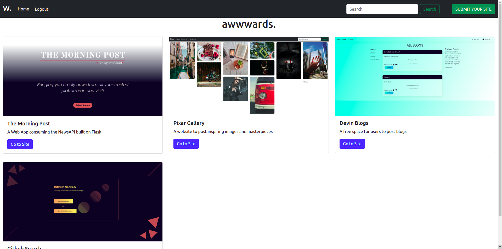

# Awwwards.

#### Awwwards is a clone of the famous Awwwards platform that ranks websites on different merits

#### By **Kelvin Gitahi, October 2021**

## Description

Awwwards is an attempt to clone the Awwwards platform using a Django backend and an Angular Frontend. I plan on continuing with the project to make it fully functional. I am open to contributions. Reach out via the channels below. Here's a screenshot of the website as it is now

## Setup/Installation Requirements

- You need a good perfoming computer/laptop: Core i3 or equivalent with high resolution display
- Clone from Github
- Open terminal on the cloned folder
- Export necessary dependecies i.e secret_key
- Run python3 manage.py runserver
- Easy Peasy😉
- Alternatively, go [here](https://awwwards-api.netlify.app/)

## Known Bugs

There are no known bugs currently but I look forward to improving the overall user experience

## Technologies Used

This site was made using:

- HTML
- CSS
- Angular 12 (TS)
- Python|Django
- PostgreSQL
- Bootstrap

## Support and contact details

I'd love to chat! Ping me on [Twitter](https://twitter.com/kevocb) should any issues arise, or just say Hi!

### License

_MIT Licence_
Copyright &copy; 2021 **Kelvin Gitahi**
